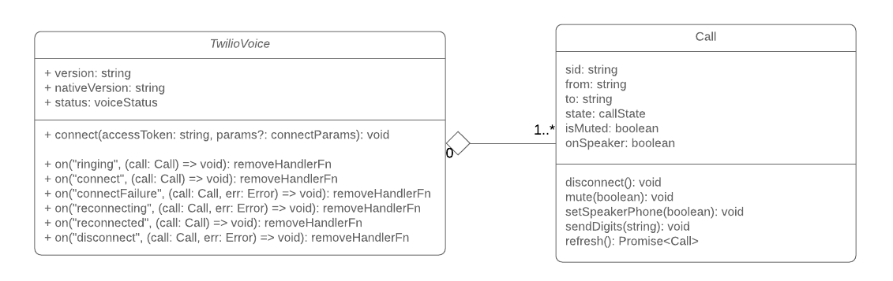

# react-native-twilio-voice-sdk
This is a React Native wrapper for Twilio Programmable Voice SDK that lets you make (and in the future receive) calls from your ReactNative App. This module is not curated nor maintained, but inspired by Twilio.

The initial version of this library was forked from [react-native-twilio-programmable-voice](https://github.com/hoxfon/react-native-twilio-programmable-voice) in order to update Twilio's programmable Voice SDK libraries to their latest version. This is specially important because version 2 of Twilio's libraries used by `react-native-twilio-programmable-voice` is going to be deprecated by Jan, 1st 2020. In order to simplify the migration, only the making calls part was migrated.

# Twilio Programmable Voice SDK

- Android 4.1.0
- iOS 4.1.0

## Installation

Before starting, we recommend you get familiar with [Twilio Programmable Voice SDK](https://www.twilio.com/docs/api/voice-sdk).
It's easier to integrate this module into your react-native app if you follow the Quick start tutorial from Twilio, because it makes very clear which setup steps are required.

This library only intends to support React Native versions over 0.60. This doesn't mean that it won't work with previous versions, just that issues related to previous versions of RN won't be actively tracked by the mantainer.

```
npm install react-native-twilio-voice-sdk --save
```

## Usage

The library tries to mimic the Twilio Voice SDK API for Android and iOS with some idiomatic changes for Javascript.

The SDK is composed of several key classes illustrated in the image below.

The class TwilioVoice is the entry point into the SDK and does the following:

- Make outgoing calls with TwilioVoice.connect(...)
- The class Call represents an outgoing call.



### Code example
```javascript
import TwilioVoice from 'react-native-twilio-voice-sdk'

// Get the library version
TwilioVoice.version

// Get the underlying native TwilioVoice library version
TwilioVoice.nativeVersion

// Subscribe to call events
let call
const removeSubscription = TwilioVoice.on("connect", connectedCall => call = connectedCall)
// call removeSubscription() to stop listening

// start a call
TwilioVoice.connect(accessToken, {to: '+61234567890'})

// hangup
call.disconnect()

// mute or un-mute the call
// mutedValue must be a boolean
call.muted(mutedValue)

// Send the call audio to the speaker phone
// speakerPhoneEnabled must be a boolean
call.setSpeakerPhone(speakerPhoneEnabled)

call.sendDigits(digits)

// Call properties
call.from
call.to
call.sid
call.state // "RINGING" | "CONNECTING" | "CONNECTED" | "RECONNECTING" | "DISCONNECTED"
```

### Events

All calls to the `on` method return a function that removes the subscription upon execution.

```javascript
TwilioVoice.on('ringing', function(call: Call): void);
TwilioVoice.on('connect', function(call: Call): void);
TwilioVoice.on('connectFailure', function(call: Call, err?: Error): void);
TwilioVoice.on('reconnecting', function(call: Call, err?: Error): void);
TwilioVoice.on('reconnect', function(call: Call): void);
TwilioVoice.on('disconnect', function(call: Call, err?: Error): void);
```

## Twilio Voice SDK reference

[iOS changelog](https://www.twilio.com/docs/api/voice-sdk/ios/changelog)

[Android changelog](https://www.twilio.com/docs/api/voice-sdk/android/changelog)

## Credits

[react-native-twilio-programmable-voice](https://github.com/hoxfon/react-native-twilio-programmable-voice)

[voice-quickstart-android](https://github.com/twilio/voice-quickstart-android)

[react-native-push-notification](https://github.com/zo0r/react-native-push-notification)

[voice-quickstart-objc](https://github.com/twilio/voice-quickstart-objc)


## License

MIT
